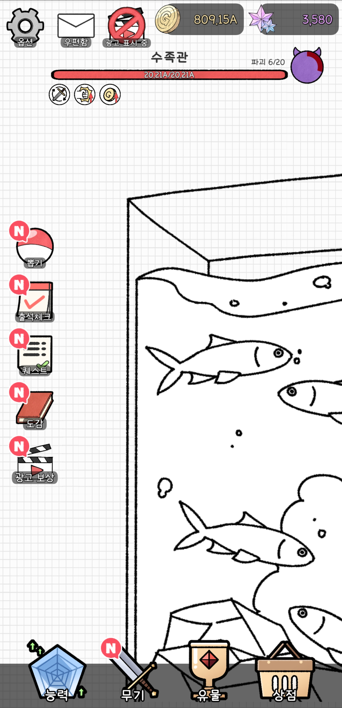

# WallBreaker

> 벽을 부수고 성장하는 Unity 기반 모바일 방치형 클리커 게임

  

## 프로젝트 개요

| 항목 | 내용 |
|---|---|
| 장르 | 방치형 / 클리커 성장 게임 |
| 플랫폼 | Android / Google Play |
| 개발 환경 | Unity, C#, PlayFab, Firebase |
| 담당 업무 | 게임 클라이언트 및 주요 시스템 개발 |

## 주요 구현 기능

- **핵심 게임플레이**: 벽부수기 플레이와 성장 시스템 구현
- **수집 및 성장 콘텐츠**: 무기·유물 뽑기와 인벤토리 시스템 구현
- **유저 데이터 관리**: PlayFab 기반 로그인 및 데이터 저장·불러오기 연동
- **모바일 수익화**: 인앱 결제 및 보상형 광고 연동
- **플레이 보상**: 출석·퀘스트·오프라인 보상 및 일일·주간 초기화 처리
- **운영 기능**: 우편함을 통한 공지 및 보상 수령 기능 구현
- **분석 및 오류 추적**: Firebase Analytics·Crashlytics 연동

---

[← 프로젝트 목록으로 돌아가기](../README.md)
