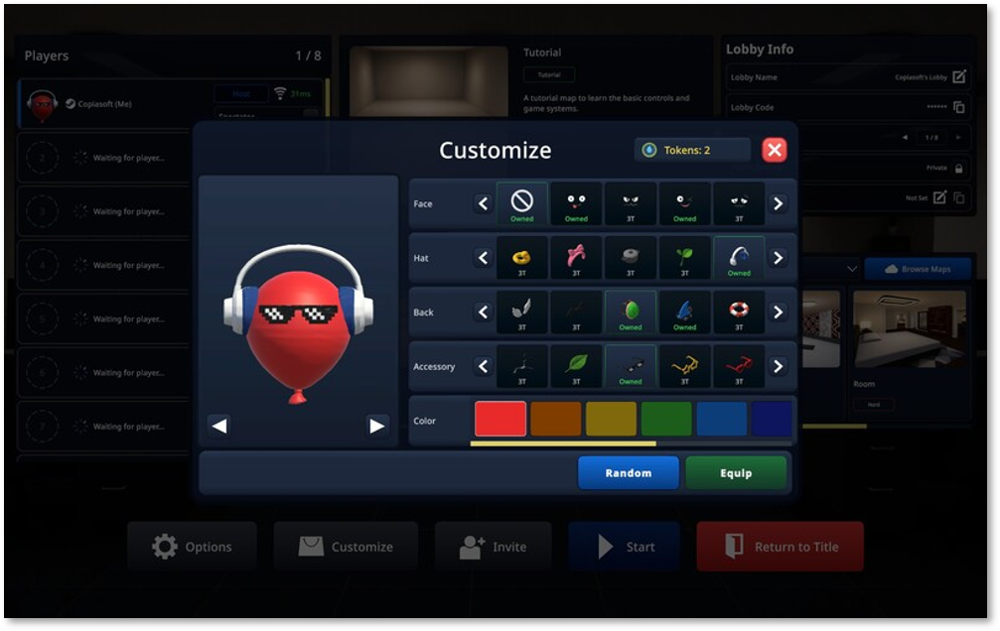

# WaterBalloon

> Unity와 Photon Fusion 기반의 온라인 멀티플레이 장애물 레이스 게임

  

## 프로젝트 개요

| 항목 | 내용 |
|---|---|
| 장르 | 멀티플레이 장애물 레이스 |
| 플랫폼 | PC / Steam, STOVE |
| 개발 환경 | Unity, C#, Photon Fusion |
| 개발 기간 | 2026.05.07 ~ 2026.07.20 (최초 Git 기록부터 출시까지) |
| 출시일 | 2026.07.20 |
| 담당 업무 | 게임 클라이언트 및 주요 시스템 개발 |

## 주요 구현 기능

- **핵심 게임플레이**: 캐릭터 조작 및 장애물 레이스 플레이 로직 구현
- **캐릭터 커스터마이징**: 외형 변경 및 코스튬 적용 기능 구현
- **커뮤니티 맵 에디터**: 사용자 제작 맵 편집 및 공유 기능 구현
- **온라인 멀티플레이**: Photon Fusion 기반 네트워크 연동 및 게임 상태 동기화
- **크로스플레이**: Steam–STOVE 사용자 간 멀티플레이 지원

---

[← 프로젝트 목록으로 돌아가기](../README.md)
